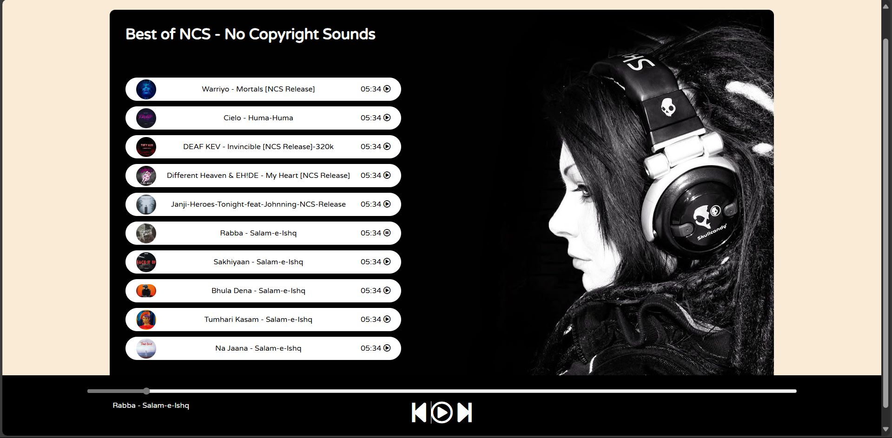

### 📌 Spotify Clone 🎵  

#### 🚀 Overview  
This is a **Spotify Clone** built using **HTML, CSS, and JavaScript**. The application allows users to:  
- **Play/Pause Music** 🎵  
- **Select & Play Specific Songs** 📌  
- **View Song List with Thumbnails** 📜  
- **Navigate Between Songs** ⏪ ▶️ ⏩  

---

#### 🛠️ Technologies Used  
- **HTML** - Structuring the Webpage  
- **CSS** - Styling the User Interface  
- **JavaScript** - Adding Music Playback Functionality  

---

#### 📷 Screenshot  
 

---

#### 🏗️ Installation & Usage  
1. Clone the repository:  
   ```sh
   git clone https://github.com/raj18patel/spotify-clone.git
   ```
2. Open `index.html` in a browser.  
3. Enjoy playing music! 🎧  

---

#### 📌 Features  
✅ Play/Pause songs  
✅ Select & play a specific song  
✅ Stylish UI with a song list  
✅ Music player controls  
